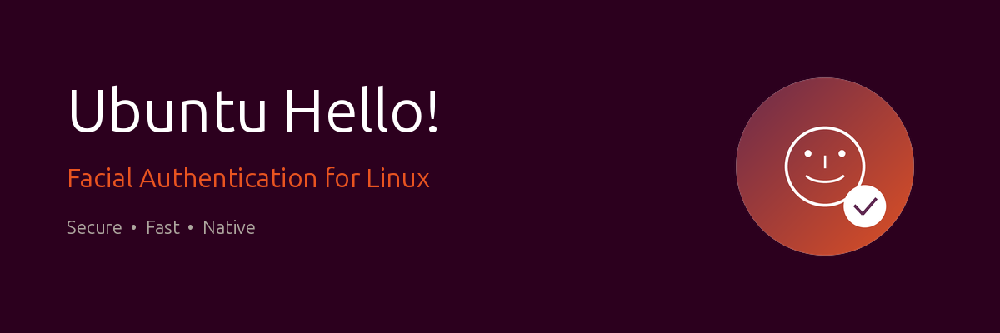

<p align="center">
	<a href="https://github.com/ventura8/ubuntu-hello/releases">
		
	</a>
	<a href="https://github.com/ventura8/ubuntu-hello/graphs/contributors">
		
	</a>
	
	
</p>

Ubuntu Hello provides Windows Hello™ style authentication for Linux. Use your built-in IR emitters and camera in combination with facial recognition to prove who you are.

Using the central authentication system (PAM), this works everywhere you would otherwise need your password: Login, lock screen, sudo, su, etc.

## ⚡ Quick Install

Open a terminal and run:

```bash
curl -fsSL https://raw.githubusercontent.com/ventura8/ubuntu-hello/master/install.sh | sudo bash
```

That's it! The installer will automatically:
- ✅ Install all required system dependencies
- ✅ Build and install Ubuntu Hello from source
- ✅ Download face recognition AI models (~100 MB)
- ✅ Configure PAM for system-wide facial authentication
- ✅ Set up Polkit for App Center face auth
- ✅ Open the configuration GUI when finished

> **After installation**, run `ubuntu-hello-gtk` to start the setup wizard and register your face!

### Uninstall

To completely remove Ubuntu Hello from your system:

```bash
curl -fsSL https://raw.githubusercontent.com/ventura8/ubuntu-hello/master/uninstall.sh | sudo bash
```

Or if you have the repo cloned:

```bash
sudo bash uninstall.sh
```

## Installation (alternative methods)

### Ubuntu or Linux Mint (PPA)

```bash
sudo add-apt-repository ppa:ventura8/ubuntu-hello
sudo apt update
sudo apt install ubuntu-hello
```

### Debian

Download the `.deb` file from the [Releases page](https://github.com/ventura8/ubuntu-hello/releases) and install with `gdebi`.

### Building from source manually

<details>
<summary>Click to expand manual build instructions</summary>

#### Dependencies

- Python 3.6 or higher (with pip, setuptools, wheel)
- meson ≥ 0.64
- ninja
- dlib (compiled via pip)
- INIReader (pulled from git automatically if not found)
- libevdev

Install dependencies on Ubuntu/Debian:

```bash
sudo apt-get update && sudo apt-get install -y \
  python3 python3-pip python3-dev python3-setuptools python3-wheel \
  python3-numpy python3-opencv python3-gi python3-gi-cairo \
  gir1.2-gtk-3.0 \
  cmake make build-essential g++ \
  libpam0g-dev libinih-dev libevdev-dev libopencv-dev \
  libboost-all-dev pkg-config \
  meson ninja-build git curl wget bzip2 \
  v4l-utils libopenblas-dev liblapack-dev
```

Install dlib:

```bash
pip3 install dlib --break-system-packages
```

#### Build & Install

```bash
meson setup builddir -Dprefix=/usr -Dsysconfdir=/etc -Dlibdir=lib \
  -Dinstall_pam_config=true -Dwith_polkit=true -Dfetch_dlib_data=true \
  -Dinih:with_INIReader=true
meson compile -C builddir
sudo meson install -C builddir
```

</details>

## Setup

After installation, Ubuntu Hello needs to learn what you look like so it can recognise you later. Run the `ubuntu-hello-gtk` configuration GUI to start the setup wizard and register your face.

If nothing went wrong we should be able to run sudo by just showing your face. Open a new terminal and run `sudo -i` to see it in action. Please check [this wiki page](https://github.com/ventura8/ubuntu-hello/wiki/Common-issues) if you're experiencing problems or [search](https://github.com/ventura8/ubuntu-hello/issues) for similar issues.

If you're curious you can run `sudo ubuntu-hello config` to open the central config file and see the options Ubuntu Hello has to offer. On most systems this will open the nano editor, where you have to press `ctrl`+`x` to save your changes.

## CLI

The installer adds a `ubuntu-hello` command to manage face models for the current user. Use `ubuntu-hello --help` or `man ubuntu-hello` to list the available options.

Usage:
```
ubuntu-hello [-U user] [-y] command [argument]
```

| Command   | Description                                   |
|-----------|-----------------------------------------------|
| `add`     | Add a new face model for a user               |
| `clear`   | Remove all face models for a user             |
| `config`  | Open the config file in your default editor   |
| `disable` | Disable or enable ubuntu-hello                       |
| `keyring` | Manage automatic keyring unlocking (enable/disable) |
| `list`    | List all saved face models for a user         |
| `remove`  | Remove a specific model for a user            |
| `set`     | Change a configuration option directly        |
| `snapshot`| Take a snapshot of your camera input          |
| `test`    | Test the camera and recognition methods       |
| `version` | Print the current version number              |

## Contributing [](https://github.com/ventura8/ubuntu-hello/tree/dev) [](https://github.com/ventura8/ubuntu-hello/issues?q=is%3Aissue+is%3Aopen+label%3Aenhancement)

The easiest ways to contribute to Ubuntu Hello is by starring the repository and opening GitHub issues for features you'd like to see.

Code contributions are also very welcome. If you want to port Ubuntu Hello to another distro, feel free to open an issue for that too.

## Troubleshooting

Any Python errors get logged directly into the console and should indicate what went wrong. If authentication still fails but no errors are printed, you could take a look at the last lines in `/var/log/auth.log` to see if anything has been reported there.

Please first check the [wiki on common issues](https://github.com/ventura8/ubuntu-hello/wiki/Common-issues) and 
if you encounter an error that hasn't been reported yet, don't be afraid to open a new issue.

## 🤖 AI Assistance

If you are developing or modifying this codebase using an AI coding assistant, please refer to the following guidebooks:
* [agent.md](agent.md) — General workspace guidelines, tech stack overview, architecture details, and coding standards.
* [skills.md](skills.md) — Functional recipes and runbooks for building, testing, troubleshooting, and extending the application.

## A note on security

This package is in no way as secure as a password and will never be. Although it's harder to fool than normal face recognition, a person who looks similar to you, or a well-printed photo of you could be enough to do it. Ubuntu Hello is a more quick and convenient way of logging in, not a more secure one.

To minimize the chance of this program being compromised, it's recommended to leave Ubuntu Hello in `/lib/security` and to keep it read-only.

DO NOT USE UBUNTU_HELLO AS THE SOLE AUTHENTICATION METHOD FOR YOUR SYSTEM.
