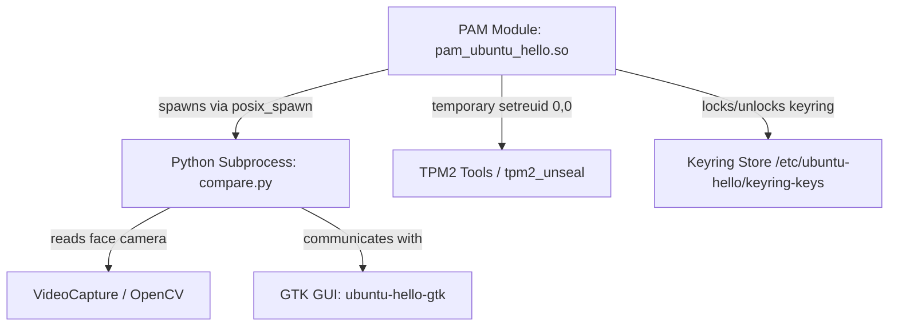

# Security Architecture and Best Practices — Ubuntu Hello

This document outlines the security architecture, threat models, and safety designs implemented in **Ubuntu Hello**.

---

## 1. Security Architecture Overview

Ubuntu Hello functions as a Pluggable Authentication Module (PAM) and GUI wizard, providing face authentication and keyring auto-unlocking on Ubuntu Linux systems. Because PAM modules run inside privileged contexts (e.g. `sudo`, `gdm-password`, `su`), security is the primary design priority.



---

## 2. Core Security Mitigations

### 2.1 privilege Isolation and Least Privilege
- **No Persistent Root Privileges**: The Python subprocess (`compare.py`) and GUI settings interface (`ubuntu-hello-gtk`) run with the privileges of the calling user, not root.
- **Strictly Scoped PAM Elevation**: When the PAM module needs to communicate with the TPM (which requires root access to read `/dev/tpmrm0`), it temporarily elevates the real UID using `setreuid(0, 0)` immediately before invoking the tool, and drops it back to the original UID immediately after process instantiation:
  ```cpp
  if (euid == 0 && ruid != 0) {
    if (setreuid(0, 0) == 0) {
      altered = true;
    }
  }
  FILE *file_pipe = popen(cmd.c_str(), type);
  if (altered) {
    if (setreuid(ruid, euid) != 0) {
      // Abort execution to prevent running under elevated privileges if dropping fails
      if (file_pipe != nullptr) {
        pclose(file_pipe);
      }
      return nullptr;
    }
  }
  ```

### 2.2 Input Sanitization & Command Injection Prevention
- **Strict Username Whitelisting**: The PAM module retrieves the username via `pam_get_user()`. To prevent path traversal or shell metacharacter injection in filesystem calls or commands, the username is validated using `is_safe_username()` before any action is taken.
- **Python-Side Validation**: The same strict username validation is enforced in both the `ubuntu-hello` Python CLI (`cli.py`) and the face comparison subprocess (`compare.py`), providing defense-in-depth against direct or indirect malicious input.
- **No Shell Interpolation**: All backend subprocess executions (in both C++ and Python) execute the binaries directly with argument lists (via `posix_spawn` or array-based `subprocess.run`/`subprocess.Popen`), completely bypassing shell parsing (`shell=True`).

### 2.3 Cryptographic Keyring & File Protections
- **Process Umask Hardening**: Both python GUI executables, the python CLI, and the python face comparison process enforce `os.umask(0o077)` immediately upon startup. This guarantees that all files, face models, keyring cache files, snapshots, and log files created by the application are restricted to `0o600` (for files) and `0o700` (for directories) by default, neutralizing race-condition time-of-check to time-of-use (TOCTOU) attacks on file permissions.
- **Access Control Lists (ACLs)**: Credentials stored under `/etc/ubuntu-hello/` are strictly isolated:
  - Configuration directory permissions: `0700` (owned by `root`).
  - Key file permissions: `0600` (owned by `root`, read/write only by `root`).
- **Hardware TPM Sealing**: When a TPM is active, credentials used for downstream PAM auto-unlocking (e.g. gnome-keyring) are sealed inside the TPM using `tpm2_create` and `tpm2_unseal`.
- **Software Fallback Cryptography**: If no TPM is available, credentials are encrypted using an XOR scheme keyed against the system's `/etc/machine-id` to protect against simple raw disk inspection.

### 2.4 Compiler & Linker Hardening
To prevent binary exploitation (such as stack overflows and GOT overwrite attacks) in the compiled C++ PAM module:
- **`-fstack-protector-strong`**: Protects the stack against stack smashing buffer overflows.
- **`-D_FORTIFY_SOURCE=2`**: Adds runtime boundary checks for memory and string manipulation operations.
- **`-Wl,-z,relro`, `-Wl,-z,now`**: Forces Read-Only Relocations and immediate binding, securing the Global Offset Table (GOT) against hijacking.

---

## 3. Threat Model and Verification

| Threat Vector | Mitigation Strategy | Verification Status |
|---|---|---|
| **Malicious Username Injection** | Enforced whitelist checking in C++ (`is_safe_username`), Python CLI, and `compare.py` | Verified via `pytest` suite |
| **Unauthorized GUI settings access** | Polkit configuration restricts access to admin authorization (`auth_admin`) | Verified in system integration |
| **Privilege Leaks to Subprocesses** | Explicit privilege drops immediately after `popen` initialization | Verified via custom regression tests |
| **Unauthorized file access** | Enforced `umask 077` on file/directory creation and strict `0700`/`0600` Unix ACL permissions | Verified in `install.sh` and tests |
