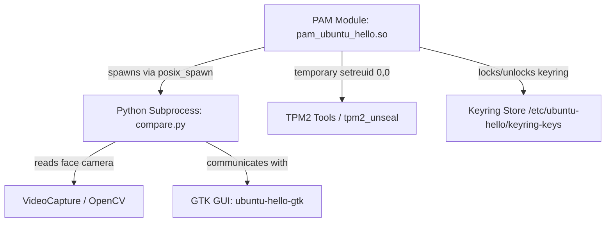

# Security Architecture and Best Practices — Ubuntu Hello

This document outlines the security architecture, threat models, and safety designs implemented in **Ubuntu Hello**.

---

## 1. Security Architecture Overview

Ubuntu Hello functions as a Pluggable Authentication Module (PAM) and GUI wizard, providing face authentication and keyring/KWallet auto-unlocking on Ubuntu Linux systems. Because PAM modules run inside privileged contexts (e.g. `sudo`, `gdm-password`, `sddm`, `su`), security is the primary design priority.



---

## 2. Core Security Mitigations

### 2.1 privilege Isolation and Least Privilege
- **Privilege boundary**: PAM runs inside the authenticating process (`sudo`, `gdm-password`, `polkit-agent-helper-1`, …), which has effective uid 0, so `pam_ubuntu_hello.so` spawns `compare.py` **as root** — it must read the root-owned models under `/etc/ubuntu-hello` and the camera device. `compare.py` never takes on more than that: it inherits no environment (see 2.2), spawns children only by absolute path, and drops to the *target user's* uid/gid for the only child that touches user-owned resources (the `gdbus` notification call on the user's session bus). The Settings GUI (`ubuntu-hello-gtk`) elevates through polkit (`auth_admin`) and runs as root for the same reason; it forwards only the display/locale environment and runs per-user probes (`gsettings`, browser hand-off) as the user via `sudo -u`.
- **Strictly Scoped PAM Elevation**: When the PAM module needs to communicate with the TPM (which requires root access to read `/dev/tpmrm0`), it temporarily elevates the real UID using `setreuid(0, 0)` immediately before invoking the tool, and drops it back to the original UID immediately after process instantiation:
  ```cpp
  if (euid == 0 && ruid != 0) {
    if (setreuid(0, 0) == 0) {
      altered = true;
    }
  }
  FILE *file_pipe = popen(cmd.c_str(), type);
  if (altered) {
    if (setreuid(ruid, euid) != 0) {
      // Abort execution to prevent running under elevated privileges if dropping fails
      if (file_pipe != nullptr) {
        pclose(file_pipe);
      }
      return nullptr;
    }
  }
  ```

### 2.2 Input Sanitization & Command Injection Prevention
- **Strict Username Whitelisting**: The PAM module retrieves the username via `pam_get_user()`. To prevent path traversal or shell metacharacter injection in filesystem calls or commands, the username is validated using `is_safe_username()` before any action is taken.
- **Python-Side Validation**: The same strict username validation is enforced in both the `ubuntu-hello` Python CLI (`cli.py`) and the face comparison subprocess (`compare.py`), providing defense-in-depth against direct or indirect malicious input.
- **No Inherited Environment / PATH**: The PAM module spawns `compare.py` as root with an explicit minimal environment (only `PATH=/usr/sbin:/usr/bin:/sbin:/bin`) and `python3 -E -s`, so a calling user's `PATH`, `PYTHONPATH`, `LD_PRELOAD` and similar can never reach the privileged helper. `compare.py` spawns its own children (`busctl`, `ubuntu-hello-gtk`) by absolute path only.
- **Notifications drop privileges**: the per-attempt desktop notification (`notify.py`) is sent on the *target user's* session bus with `subprocess` `user=/group=/extra_groups=[]` (C-level identity change, no `preexec_fn`) before exec'ing the absolute `/usr/bin/gdbus`; root never connects to a user bus, and the card body is markup-escaped. Root keeps its notification-id state only in the root-owned `/run/ubuntu-hello/notify/` (0700, `lstat`-verified, `O_NOFOLLOW`, no `chown`) — never in the user-controlled `/run/user/<uid>/`, where a symlink could redirect a privileged write. Failures only disable the card, never affect the auth result.
- **Polkit helper sandbox**: polkit ≥ 126 runs `polkit-agent-helper-1` under `DevicePolicy=strict` + `ProtectSystem=strict`; the shipped drop-in re-allows exactly the camera, `/dev/uinput`, the TPM devices (`char-tpm`, `/dev/tpm0`), write access to `/etc/ubuntu-hello/tpm-keys` (transient `.ctx` files) and `/run/ubuntu-hello` (root-only notification-id state), and — instead of relaxing `ProtectHome` — keeps `/home` and `/root` **empty** inside the unit (`ProtectHome=tmpfs`) and binds only `/run/user` back in (`BindReadOnlyPaths=-/run/user` (a read-only bind: the helper only connects to the target user's session-bus socket after dropping to that uid; root itself is rejected by the user's bus, and no runtime file can be written or replaced)) so the user's session-bus socket is reachable for the desktop notification; the notifier drops to the target uid before connecting, so other users' runtime dirs (0700) stay inaccessible. Nothing broader.
- **No Shell Interpolation**: All backend subprocess executions (in both C++ and Python) execute the binaries directly with argument lists (via `posix_spawn` or array-based `subprocess.run`/`subprocess.Popen`), completely bypassing shell parsing (`shell=True`).

### 2.3 Cryptographic Keyring & File Protections
- **Process Umask Hardening**: Both python GUI executables, the python CLI, and the python face comparison process enforce `os.umask(0o077)` immediately upon startup. This guarantees that all files, face models, keyring cache files, snapshots, and log files created by the application are restricted to `0o600` (for files) and `0o700` (for directories) by default, neutralizing race-condition time-of-check to time-of-use (TOCTOU) attacks on file permissions.
- **Access Control Lists (ACLs)**: Credentials stored under `/etc/ubuntu-hello/` are strictly isolated:
  - Configuration directory permissions: `0700` (owned by `root`).
  - Key file permissions: `0600` (owned by `root`, read/write only by `root`).
- **Hardware TPM Sealing**: When a TPM is active, credentials used for downstream PAM auto-unlocking are sealed inside the TPM using `tpm2_create` and `tpm2_unseal`. After face auth, `pam_ubuntu_hello` sets `PAM_AUTHTOK` for consumers such as **`pam_gnome_keyring`** (GNOME/Ubuntu-family) and **`pam_kwallet5`** (KDE Plasma / KWallet). The same sealed blob is used for both; there is no KWallet-specific ciphertext format.
- **Software Fallback Cryptography**: If no TPM is available, credentials are encrypted with **AES-256-GCM** using a randomly generated 32-byte master key stored at `/etc/ubuntu-hello/keyring-master.key` (`0600`, directory `0700`). Ciphertext is stored as `UH1:` + base64(`nonce || ciphertext || tag`). Legacy XOR/`machine-id` blobs are **not decrypted** on face authentication.
- **Legacy migration**: Re-running `ubuntu-hello keyring enable` always overwrites software blobs with `UH1:`. On password login, `pam_sm_setcred` rewrites an existing keyring key file (including legacy XOR) by piping `PAM_AUTHTOK` into `ubuntu-hello keyring enable -U <user>`, upgrading credentials in place.
- **Desktop coverage**: Face auth through `common-auth` is DE-agnostic. Wallet unlock depends on the PAM stack shipping an AUTHTOK consumer (`pam_gnome_keyring` and/or `pam_kwallet5`). Packaging **Depends** on both `libpam-gnome-keyring` and `libpam-kwallet5` so every supported DE can unlock the session wallet after face auth.
- **Uninstall restore**: `uninstall.sh` and `debian/ubuntu-hello.prerm` call `timeout 120 ubuntu-hello keyring restore --all` **before** deleting `/etc/ubuntu-hello`. The helper decrypts each user’s sealed login password (TPM or `UH1:`) and re-asserts it as the GNOME Keyring master password (`ChangeWithMasterPassword`, old=new=`P`) or verifies KWallet via `pamOpen` (does not change the KWallet password). `ChangeWithMasterPassword` needs the **current** wallet password; Ubuntu Hello only has sealed `P`, so restore succeeds when the wallet already unlocks with `P` and **cannot** discover a divergent wallet password. Failures warn and **do not** abort removal. The password is never logged. Manual recovery remains Seahorse / KDE Wallet settings. `ubuntu-hello keyring disable` deletes seals without restoring.

### 2.4 Compiler & Linker Hardening
To prevent binary exploitation (such as stack overflows and GOT overwrite attacks) in the compiled C++ PAM module:
- **`-fstack-protector-strong`**: Protects the stack against stack smashing buffer overflows.
- **`-D_FORTIFY_SOURCE=2`**: Adds runtime boundary checks for memory and string manipulation operations.
- **`-Wl,-z,relro`, `-Wl,-z,now`**: Forces Read-Only Relocations and immediate binding, securing the Global Offset Table (GOT) against hijacking.

### 2.5 Strictness of the face match
The match threshold (`[video] certainty`) is a Euclidean distance on dlib's 128-d descriptor, times ten; lower is stricter, and dlib's own "same person" reference is 6.0, so all three shipped levels sit far inside it. Lowering it further is not the only lever, and past a point not a safe one at all. Measured on this project's IR hardware with a single enrolled model, the distance to the *same* face moves by roughly 0.4 between lighting conditions — enough that a threshold chosen to sit just under one session's numbers rejects that same person outright in the next. A threshold must therefore be picked with margin for that drift, not fitted to one measurement.

A scan takes dozens of independent looks at the camera, so accepting on the first frame under the bar means the deciding frame is the *minimum* of many draws — a single blurred or oddly lit frame from a stranger could carry the whole attempt. `[video] confirmations` requires several separate frames to agree before the match is trusted. The legitimate user, who matches a good share of frames, reaches the count in a fraction of a second; an isolated outlier never does. Every level asks for more than one, and a stricter level asks for more: Fast (3.5) 2, Balanced (3.0) 3, Secure (2.6) 4. The looser levels need it most, because a higher threshold lets far more frames through in the first place. A config written before this key existed keeps the historical single frame.

Neither setting defends against a video replay of the user's face. That is the documented limit of challenge-response liveness (ISO/IEC 30107-3); the optional nod defeats a still photo, not a recording.

### 2.6 Greeter availability (do not lock out login)
- Concurrent `pam_get_authtok` is **workaround-gated** (`input` / `native` only). With `workaround=off`, greeters must run face-only without forcing a password conversation.
- Forcing greeter `pam_get_authtok` or custom `PAM_CONV` wrappers on `gdm-password` aborts GDM user-selection → login (account-list bounce). Treat that as a **login lockout regression**, not an Esc/camera fix.
- Canonical gate: `ask_pass = ask_auth_tok && workaround != Off` in `ubuntu-hello/src/pam/main.cc`. Agent rulebook: [AGENTS.md](../AGENTS.md), [`.agents/skills/pam-verifier/SKILL.md`](../.agents/skills/pam-verifier/SKILL.md).

---

## 3. Threat Model and Verification

| Threat Vector | Mitigation Strategy | Verification Status |
|---|---|---|
| **Malicious Username Injection** | Enforced whitelist checking in C++ (`is_safe_username`), Python CLI, and `compare.py` | Verified via `pytest` suite |
| **Unauthorized GUI settings access** | Polkit configuration restricts access to admin authorization (`auth_admin`) | Verified in system integration |
| **Privilege Leaks to Subprocesses** | Explicit privilege drops immediately after `popen` initialization | Verified via custom regression tests |
| **Unauthorized file access** | Enforced `umask 077` on file/directory creation and strict `0700`/`0600` Unix ACL permissions | Verified in `install.sh` and tests |
| **Privileged postinstall lock/log hijack** | Lock and log live under `/run/ubuntu-hello` (`0700`), opened with `O_NOFOLLOW` (and `O_EXCL` after dropping foreign leftovers); dpkg postinst does not append to `/tmp` | Verified in `tests/test_run_after_install.py` |
| **GDM greeter login lockout** | Never force greeter `pam_get_authtok` when `workaround=off` | Documented HARD RULE; recover via TTY + comment `pam_ubuntu_hello.so` |
| **Lookalike admitted by one outlier frame** | `[video] confirmations` — several separate frames must fall inside `certainty` before the match is trusted (2 at Fast, 3 at Balanced, 4 at Secure) | Verified in `tests/test_compare_confirmations.py`, which runs the real scan loop |
| **Photo held up to the camera** | Opt-in nod challenge (`[rubberstamps] enabled`), written `failsafe` so a timeout aborts authentication | Verified in `tests/test_rubberstamps.py` and live on IR hardware |
